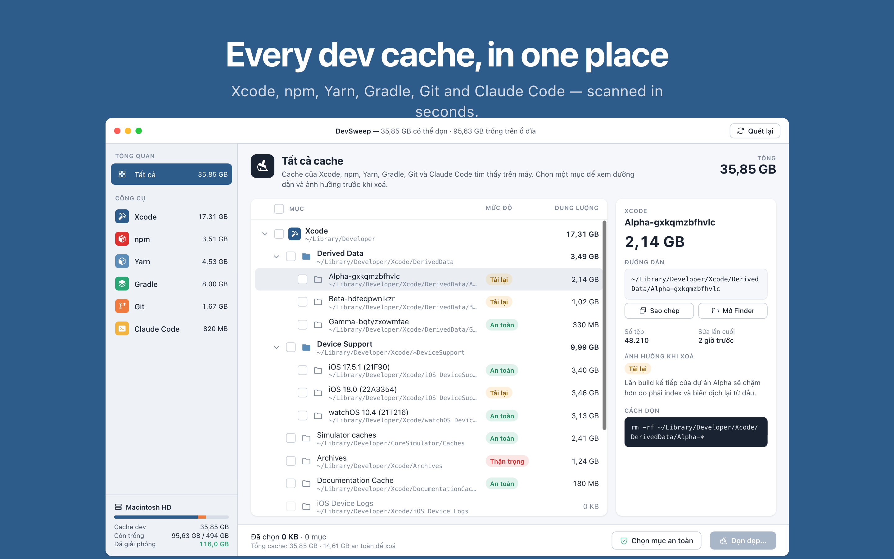

# Yeet

**English** · [Tiếng Việt](README.vi.md)

Yeet is a native macOS app (SwiftUI, macOS 14+) that finds and cleans the caches left behind by developer tools: **Xcode, npm, Yarn, Gradle, Git, Claude Code** and more. For every item it shows the size, the real path on disk, what happens if you delete it, and the command used to clean it.



**Languages:** English (default) and Vietnamese. Switch in **Settings (⌘,) → Language**.

## Build & run

Requirements:

- macOS 14 Sonoma or later
- Xcode 15+ (or Command Line Tools with Swift 5.9+)
- Optional: [XcodeGen](https://github.com/yonaskolb/XcodeGen) (`brew install xcodegen`) if you change `project.yml`

```bash
git clone git@github.com:tranhuuthinhit/yeet.git
cd yeet

# Quick run while developing (SwiftPM; no app bundle, no icon)
swift run

# Package the direct-distribution app (no sandbox, with icon)
./scripts/build-app.sh             # → build/Yeet.app
./scripts/build-app.sh --install   # → also copies it to /Applications

# Open in Xcode (icon, assets, Debug / Release / AppStore configurations)
open Yeet.xcodeproj                # scheme "Yeet" → ⌘R
```

Command-line build with Xcode:

```bash
xcodebuild -project Yeet.xcodeproj -scheme Yeet -configuration Release \
  -destination 'platform=macOS' CODE_SIGNING_ALLOWED=NO build
```

`Yeet.xcodeproj` is generated from `project.yml`. If you add or remove source files, run `xcodegen generate` to update the project (SwiftPM picks up new files automatically).

**Code signing.** `build-app.sh` uses an *Apple Development* / *Developer ID* certificate when one is available and falls back to ad-hoc signing otherwise. Pick a specific one with `SIGN_IDENTITY="Apple Development: Your Name (TEAMID)" ./scripts/build-app.sh`. In Xcode, choose your team under target **Yeet → Signing & Capabilities**.

**Bundle ID for forks.** The default bundle ID is **`vn.stevetran.yeet`** (in `project.yml`, `scripts/build-app.sh` and `scripts/release-appstore.sh`). Change it if you ship your own build.

Icons live in `Support/Assets.xcassets/AppIcon.appiconset` (Xcode) and `Support/AppIcon.icns` (SwiftPM build).

### Full Disk Access

On first launch Yeet walks you through granting **Full Disk Access** (System Settings → Privacy & Security → Full Disk Access → add `Yeet.app`). Without it Yeet can still scan most caches in your home folder. Grant it to the `.app` in `/Applications` so macOS remembers it.

**Granted Full Disk Access but Yeet still says "Not granted"?**

1. **Run the real Yeet.app.** With `swift run` or Xcode, macOS applies the permission to Terminal/Xcode, not Yeet. Build with `./scripts/build-app.sh --install` and open `/Applications/Yeet.app`.
2. **Relaunch the app.** macOS usually applies a new grant only after the app restarts. The **Relaunch Yeet** button is on the permission screen (and in Settings ⌘,).
3. **After rebuilding:** an ad-hoc signature changes with every build, so the old grant stops working. Run `tccutil reset SystemPolicyAllFiles vn.stevetran.yeet`, then add Yeet.app to Full Disk Access again. If you have an *Apple Development* certificate (signing in to Xcode with an Apple ID gives you one), the script uses it and the grant survives rebuilds.

### Mac App Store build

The **Yeet** scheme in `Yeet.xcodeproj` has:

- **Run** (⌘R) with the *Debug* configuration: no sandbox.
- **Archive** with the **AppStore** configuration: App Sandbox on, `APPSTORE` compilation flag, `Support/YeetAppStore.entitlements`.

To upload: pick your Team, bump the build number, choose **Any Mac** and run **Product → Archive**, then **Distribute App → App Store Connect → Upload** in the Organizer. Or do it from the command line:

```bash
cp scripts/appstore.env.example scripts/appstore.env   # fill in TEAM_ID (and optionally an API key)
./scripts/release-appstore.sh            # archive + upload
./scripts/release-appstore.sh --export   # archive + export a signed .pkg only
```

Store listing text (EN/VI) is in `AppStore/Listing.md`, screenshots in `AppStore/Screenshots/`.

What's different in the App Store (sandboxed) build:

- The user picks their home folder once; access is kept with a security-scoped bookmark. No Full Disk Access.
- No CLI commands (`npm`, `yarn`, `git`, `xcrun`, `gradle`); every item is removed by deleting files directly.
- No Git group (only `git` can clean it safely), no simulator runtimes, Conda, or macOS installers in `/Applications`.

## Features

- Sidebar with "All" and each tool, with sizes. Disk usage bar and a running total of space **Freed** (kept between launches).
- Cache tree with tri-state checkboxes, expandable groups and **Safe / Re-download** badges.
- Inspector: path (selectable, **Copy**, **Show in Finder**), file count, last modified, impact of deleting, and the clean command.
- **Select Safe Items**, **Clean Up…** with a confirmation (warns when a related app is still running), a progress bar and a toast.
- Tools are scanned in parallel (`TaskGroup`) and results appear as they come in. After cleaning, Yeet rescans the affected tools.
- Settings (⌘,): language, show paths, hide empty items, confirm before cleaning, and the project folders searched for Git repos (default `~/Projects`, `~/Developer`).
- **Hide tools you don't use:** right-click a tool in the sidebar → *Hide*, or toggle tools under Settings → **Scanned Tools**. Hidden tools are not scanned, shown, or counted.
- **Growth:** daily disk snapshots answer "yesterday I had 120 GB free, why is it 105 GB today?". Compare with the previous snapshot, ~7 days, ~30 days or any day, see a 30-day chart and a tree of folders sorted by growth. Snapshots are stored locally in `~/Library/Application Support/Yeet/Snapshots` (60 days) and never leave your Mac.
- **Menu bar mode:** closing the window keeps Yeet running in the menu bar so daily snapshots continue. Optional *Open at login* and *Notify when the disk grows fast*.
- **Never surprise permission prompts:** Desktop, Documents, Downloads, other apps' containers and cloud drives are only measured with Full Disk Access or after you click **Allow Now**.
- Shortcuts: ⌘R rescan · ⇧⌘G analyze disk usage · ⌘. stop analysis · ⇧⌘S select safe items · ⇧⌘D deselect all · ⌘⌫ clean up.

## What gets scanned

Yeet only lists items that are **Safe** (recreated automatically) or **Re-download** (downloaded/rebuilt on next use). Things that can't be recreated are **never listed**: Xcode Archives, Claude Code session history, iPhone backups, iMessage attachments, Time Machine snapshots, Android emulators, Docker disks, virtualenvs/Conda envs.

Paths are relative to `~` unless noted.

| Group | Paths | How it's cleaned |
|---|---|---|
| **Xcode** | `Library/Developer/Xcode/DerivedData/*`, `*DeviceSupport/*`, `CoreSimulator/Caches`, `DocumentationCache`, `iOS Device Logs`, `Library/Caches/com.apple.dt.Xcode`, `Library/Developer/XCPGDevices` | `rm -rf`, `xcrun simctl delete unavailable` |
| | Simulator runtimes (`xcrun simctl runtime list`), direct build only | `xcrun simctl runtime delete` |
| **CocoaPods & SPM** | `Library/Caches/CocoaPods`, `Library/Caches/org.swift.swiftpm`, `Library/Caches/org.carthage.CarthageKit` | `pod cache clean --all`, `rm -rf` |
| **npm** | `.npm/_cacache`, `_npx`, `_logs` | `npm cache clean --force` |
| **Yarn** | `Library/Caches/Yarn/v*`, `.yarn/berry/cache` | `yarn cache clean` |
| **pnpm & Bun** | `Library/pnpm/store`, `Library/Caches/pnpm`, `.bun/install/cache` | `rm -rf`, `bun pm cache rm` |
| **node_modules** | `node_modules` next to a `package.json` in your project folders (Safe if untouched for 30+ days) | `rm -rf` |
| **Python** | `Library/Caches/pip`, `Library/Caches/pypoetry/{cache,artifacts}`, `.cache/uv`, `*conda*/pkgs` (direct build only) | `uv cache clean`, `conda clean --all` |
| **Go** | `Library/Caches/go-build`, `go/pkg/mod` | `go clean -cache` / `-modcache` |
| **Rust** | `.cargo/registry/{cache,src}`, `.cargo/git/checkouts`, project `target/` (with `CACHEDIR.TAG`) | `rm -rf`, `cargo clean` |
| **Gradle** | `.gradle/caches/*`, `wrapper/dists/*`, `daemon` | `rm -rf`, `gradle --stop` |
| **Maven** | `.m2/repository`, `.m2/wrapper/dists` | `rm -rf` |
| **Flutter & Dart** | `.pub-cache/hosted`, `.pub-cache/git` | `rm -rf` |
| **Homebrew** | `Library/Caches/Homebrew`, `Library/Logs/Homebrew` | `brew cleanup --prune=all -s` |
| **Git** (direct build only) | `.git/lfs/objects`, loose objects | `git lfs prune`, `git gc --prune=now` |
| **Claude Code** | `Library/Caches/claude-cli-nodejs`, `.claude/shell-snapshots`, `.claude/todos`; Cowork VM `vm_bundles/*.bundle` (`rootfs.img`, leftover `.zst`/`.partial`, kernel/initrd); app `Cache`, `Code Cache` | `rm -rf`, once Claude has quit |
| **IDEs & editors** | VS Code / Cursor / Windsurf: `Cache`, `CachedData`, `CachedExtensionVSIXs`, `Code Cache`, `GPUCache`, `logs`; JetBrains: caches of **old versions**, `Library/Logs/JetBrains` | `rm -rf`, once the IDE has quit |
| **App caches** | Slack, Discord, Teams, Figma, Notion (`Cache`, `Code Cache`, `GPUCache`); `Library/Caches/Google/Chrome`; other `Library/Caches/<bundle id>` folders ≥ 10 MB (excluding `com.apple.*`) | `rm -rf`, once the app has quit |
| **macOS** | `Library/Logs/DiagnosticReports` and other logs ≥ 1 MB, `.Trash`, `.dmg/.pkg/.xip/.ipsw` in `Downloads`, `/Applications/Install macOS *.app` (direct build only), `Library/iTunes/*Software Updates`, opened Mail attachments | `rm -rf` |

Project folders (used for Git, node_modules and Rust `target/`) are set in Settings → **Project Folders**. Defaults: `~/Projects` and `~/Developer`.

**Safety rules when deleting:**

- Only deletes inside your home folder (never the home folder itself); the only exception is `/Applications/Install macOS *.app`.
- Refuses to delete a folder that is a symlink pointing outside your home folder.
- Never scans inside `.app` bundles.
- Asks you to quit an app before deleting its cache.
- Tool-specific commands run through `zsh -lc` to get the Homebrew/nvm `PATH`. If a command fails, Yeet deletes the cache folder directly. Git is only cleaned with `git` itself; `.git/objects` is never deleted.

Sizes are the real allocated size on disk (`totalFileAllocatedSize`), in decimal units like Finder.

## Project structure

```
Sources/Yeet/
  YeetApp.swift          App, window, Cache menu, Settings
  Core/
    L10n.swift           UI language (English / Vietnamese) and the L(en, vi) helper
    Models.swift         Risk, ToolKind, CacheNode, CleanAction…
    Scanner.swift        Finds and measures caches for each tool
    ScannerExtra.swift   Extra cache groups (SPM, pnpm, Python, Go, Rust, IDEs, apps, macOS…)
    Growth.swift         Daily disk snapshots, comparison, notifications, open at login
    ProtectedFolders.swift  Desktop/Documents/Downloads/Containers: read only when allowed
    Cleaner.swift        Deletion / commands, Full Disk Access check
    AppModel.swift       App state (@Observable): selection, expansion, scanning, cleaning
    Format.swift         Size/date formatting per language, paths
    Theme.swift          Design tokens, button styles, cards
  Views/                 Sidebar, Header, CacheTree, Inspector, Footer, Growth,
                         ConfirmOverlay, Onboarding, Settings, MenuBar, Components
Support/
  Info.plist             Bundle metadata
  Assets.xcassets        App icon (Xcode) · AppIcon.icns (SwiftPM)
  Yeet.entitlements      Direct build (no sandbox)
  YeetAppStore.entitlements  App Store build (sandbox + bookmark)
  PrivacyInfo.xcprivacy  Privacy manifest
project.yml              XcodeGen spec → Yeet.xcodeproj
Yeet.xcodeproj           Xcode project (scheme Yeet: Run = Debug, Archive = AppStore)
AppStore/                Store listing EN/VI, screenshots, 1024 icon
scripts/
  build-app.sh           Package Yeet.app (direct distribution)
  release-appstore.sh    Archive + upload to the Mac App Store
  appstore.env.example   Team / API key config
```

## Contributing

Issues and pull requests are welcome.

- **UI strings:** every user-visible string goes through `L(_ en:, _ vi:)` in `Sources/Yeet/Core/L10n.swift`, with both translations side by side:

  ```swift
  Text(L("Rescan", "Quét lại"))
  ```

  Always provide both English and Vietnamese when you add a string.
- **New source files:** SwiftPM picks them up automatically; run `xcodegen generate` so `Yeet.xcodeproj` includes them too.
- **Safety first:** a new cache location should only be listed if it is recreated automatically (Safe) or re-downloaded on next use (Re-download).
- Before opening a PR, make sure `swift build` and the Xcode build both succeed.

## Notes

- **No icon in the Dock when running from Xcode?** Open `Yeet.xcodeproj`, not `Package.swift` (the SwiftPM build has no bundle or assets). If you still see the default icon, run **Product → Clean Build Folder** (⇧⌘K), then `killall Dock`.
- The UI uses light mode by design (dark mode isn't done yet).
- The direct build (Debug/Release, `build-app.sh`) doesn't use the App Sandbox. The Mac App Store build is the `AppStore` configuration.

## License

[MIT](LICENSE) © 2026 Steve Tran
